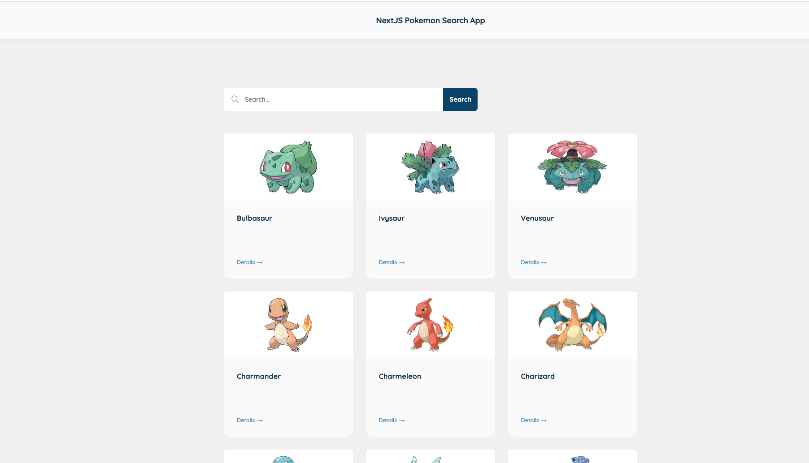
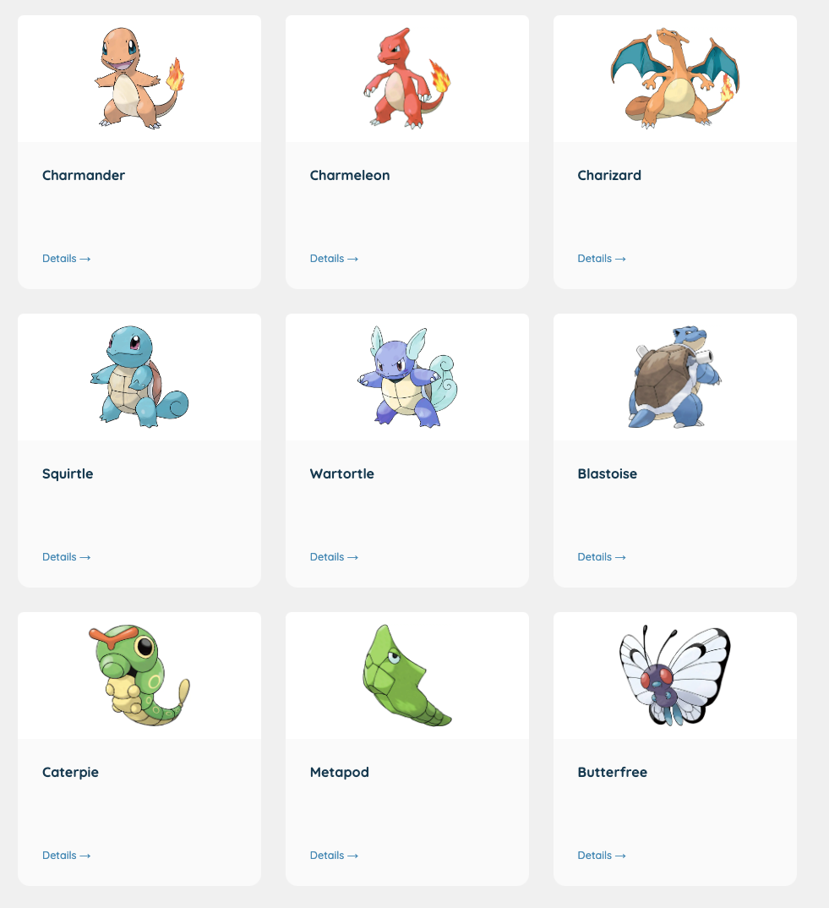
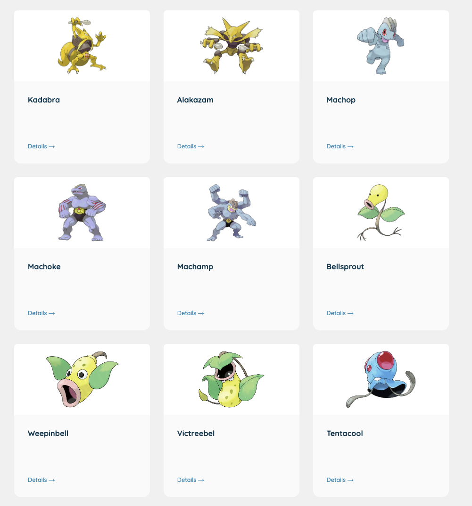

# NextJS Pokemon Search App

This is a Next.js frontend web app that consumes the Pokemon API at https://pokeapi.co. It has been built using stitches.dev,
react query, zustand, and TypeScript. The app follows the atomic design pattern principles for the UI development.

## Screen Shot

# About

This Next.js frontend web app is a user-friendly interface that allows users to browse and search for Pokemon data from the Pokemon API.
Built with server-side rendering, it delivers fast and reliable performance and enhances SEO.
The app features a search bar that utilizes debounce functionality for efficient searches, and infinite scroll for effortless browsing of large amounts of data.

This app follows the Atomic Design Pattern, which breaks down the interface into smaller, reusable components. These components are built with stitches.dev,
a CSS-in-JS library that provides high-performance styles. The app's state management is powered by Zustand, a lightweight and fast state management
library for React, while its code quality is improved by TypeScript, a statically typed programming language.

Overall, this app provides a seamless and intuitive experience for users to browse and search for Pokemon data.
Its fast performance, responsive design, reusable components, and efficient search and browsing features make it a showcase of the power and flexibility of the Next.js framework.

# File Structure

# Highlights

1. Server-side rendering for improved performance and SEO
2. Image caching with react query for fast loading times
3. Debounce for search feature to improve usability
4. Infinite scroll to load more results
5. Responsive design for seamless use on any device
6. Global style and typography with stitches.dev for consistent branding and design across the app

# Technologies

[Next js](https://camo.githubusercontent.com/8ca13ae629f63bb61149ae72a664da344efef97067b0cbf6d6cbabdc6784068f/68747470733a2f2f696d672e736869656c64732e696f2f62616467652f2d4e6578744a532d3030303030303f6c6f676f3d6e657874646f746a73)
[React js](https://camo.githubusercontent.com/87051e6a6583fbd038af6b402cacb98f48af5d458f56f039a1a467628ed4a742/68747470733a2f2f696d672e736869656c64732e696f2f62616467652f2d52656163744a532d3631444146423f6c6f676f3d7265616374266c6f676f436f6c6f723d626c61636b)
[TypeScript](https://camo.githubusercontent.com/0b289d1d303799715fec1914d704e8683305e5151dceff8e7d946b9924c7d62a/68747470733a2f2f696d672e736869656c64732e696f2f62616467652f2d547970655363726970742d3331373843363f6c6f676f3d54797065536372697074266c6f676f436f6c6f723d7768697465)
[Zustand](https://camo.githubusercontent.com/74b774118ff07a8755255a0de08b52114fa0012dfff18f7ba44134de922a36cc/68747470733a2f2f696d672e736869656c64732e696f2f62616467652f2d5a757374616e642d4445423838373f6c6f676f436f6c6f723d7768697465)
[React Query](https://camo.githubusercontent.com/b2e9e861a5f6af824a941a593cacc09fa32ad87394dfaa6de88d45651e213250/68747470733a2f2f696d672e736869656c64732e696f2f62616467652f2d526561637425323051756572792d4646343135343f6c6f676f3d72656163747175657279266c6f676f436f6c6f723d7768697465)

1. Stitches.dev: A CSS-in-JS library for creating high-performance, scalable styles
2. React Query: A powerful data-fetching library for React applications
3. Zustand: A small, fast state management library for React
4. TypeScript: A statically typed programming language that improves code quality and reduces errors

# Features:

1. Suggestion based search bar
2. Fast loading of cached content
3. Get information about any existing pokemon quickly
